# Summary of Mech. Engineering Projects

[//]: # (This repository contains briefly overwiev of some projetcts what I have done over time. Due to this fact, that overview was splitted to [Mechanical]&#40;#header&#41; and [ITC]&#40;#header&#41; section. For more information don't hesitate click on highlighted links. )

[//]: # (## Mechanical engineering section)

### Amtek,.s.r.o (2020 - 2022)

During my contract at <a href="https://www.amtek.cz/"> AMTEk, s.r.o.</a>, the main task of my position was designing of security fences from aluminum profiles. Each fence layout is based on the customer's specifications and it is fitted with reinforcements, doors or active-electronic devices (sensors, electronic locks, cameras, security lights, etc.) as needed. Thanks to the variability of the MayCad profile system it is possible to quickly and cheaply create machine frames and thus replace the need for the production of specific parts and welding these parts into larger asemblies. (click <a href="https://github.com/StingrayCZ/Amtek-Projects#readme"> here</a> for see more projects)

  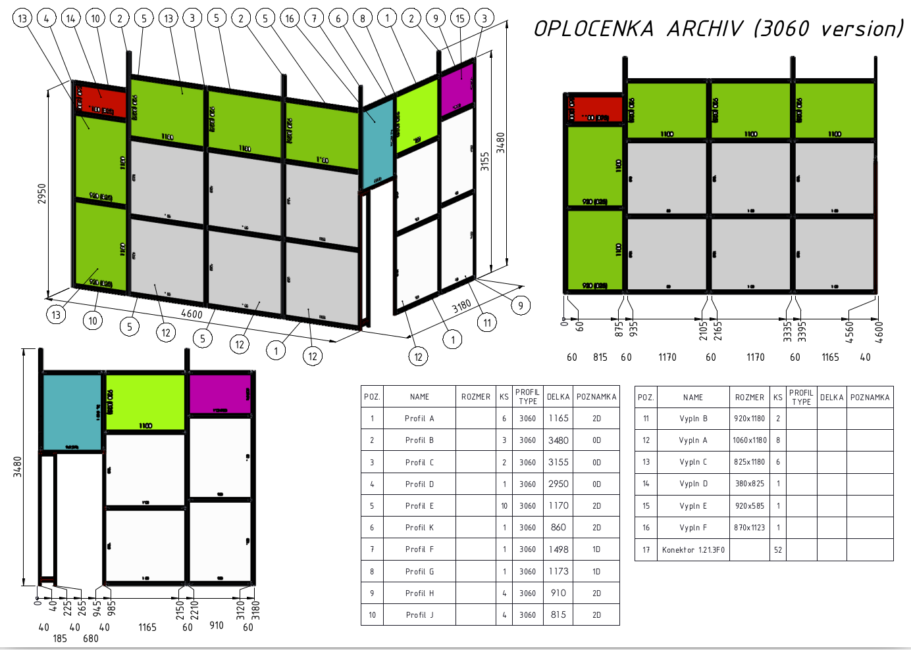 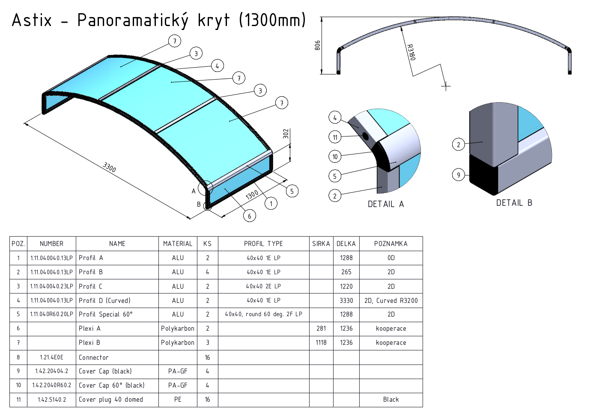 

### Beekeeping - my leisure activity (2021 - present)

This chapter does not describe any work experience. There you can find a brief presentation of the step-by-step construction of my bee hobby farm. Click <a href="https://github.com/StingrayCZ/Bee-Farm/tree/EN"> here</a> for see more details.

  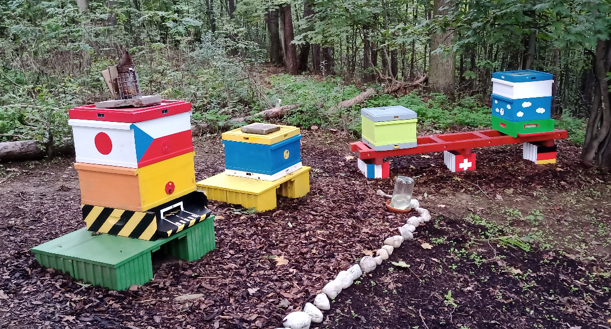 

### Special Industrial Rack (Erba Lachema, 2019 - 2020) [SolidWorks]
The special rack for storing parts from metal sheets. (click <a href="https://github.com/StingrayCZ/Special-Industrial-Rack/blob/master/README.md"> here</a> for more details)

  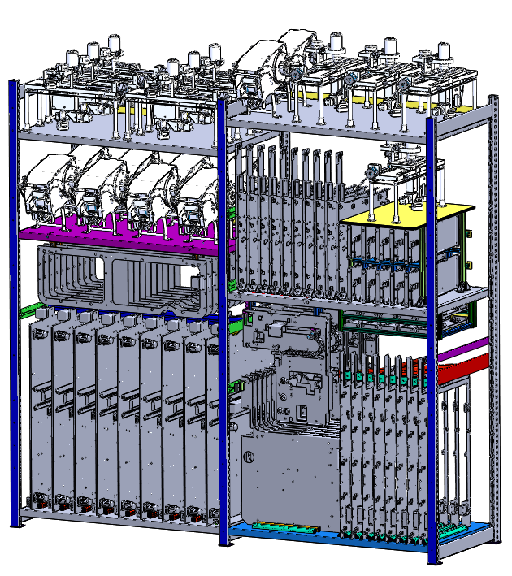 

### Medical Instrument Assembly Building (Erba Lachema, 2019 - 2020) [SolidWorks]
Proposal layout of the manufacturing complex (assembly lines, offices, workshops, cloakrooms, warehouse). (click <a href="https://github.com/StingrayCZ/Medical-Instrument-Assembly-Building/blob/master/README.md"> here</a> for more details)

  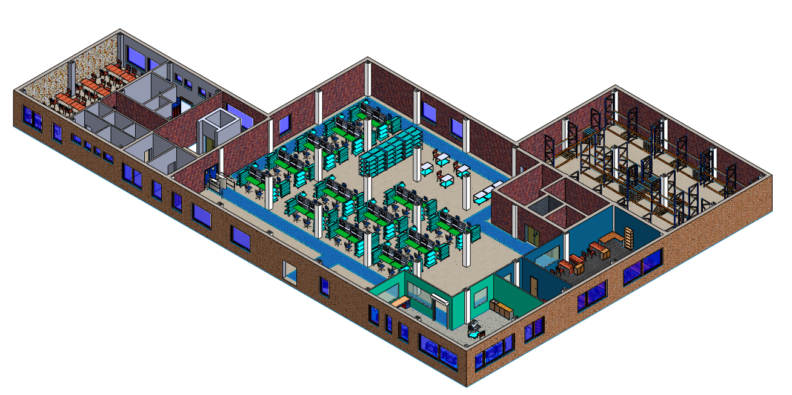

### Assembly Instructions for Workers (Erba Lachema, 2019 - 2020) [SolidWorks]
An example of assembly manual for assembly. The goal was to create an understandable and simple form of interpretation.

  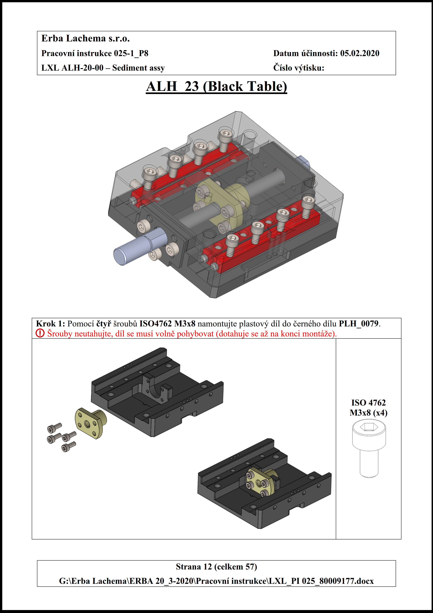 
  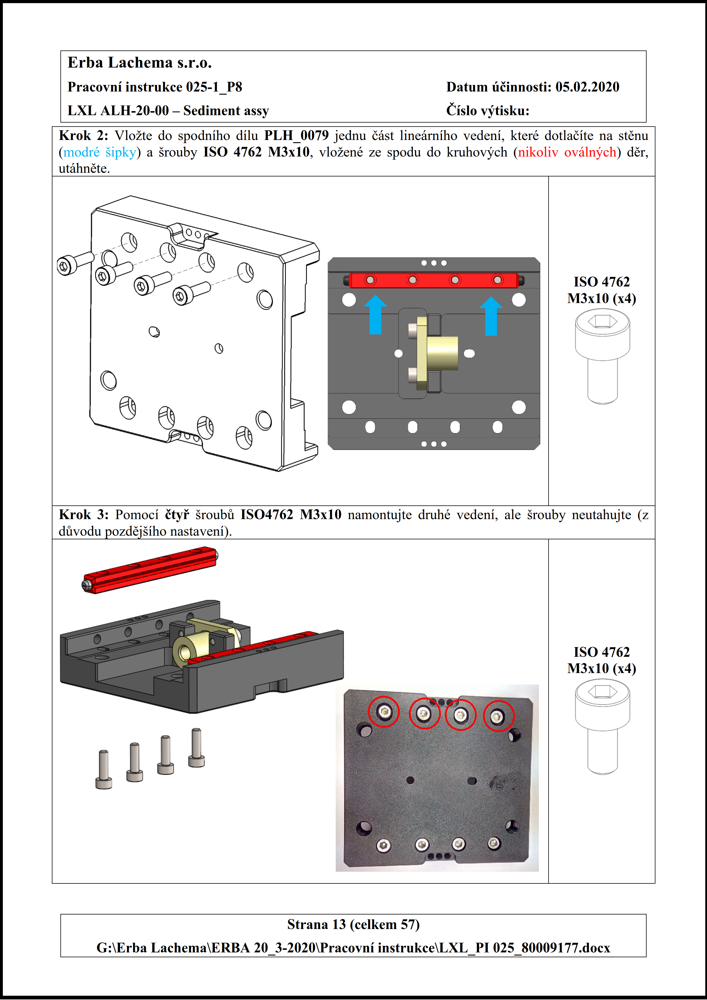 

### Bench for Testing Component (Erba Lachema, 2019 - 2020) [SolidWorks]
This bench is used for testing and adjust subassemblies.  (click <a href="https://github.com/StingrayCZ/Bench-for-Testing-Component/blob/master/README.md"> here</a> for more details)

  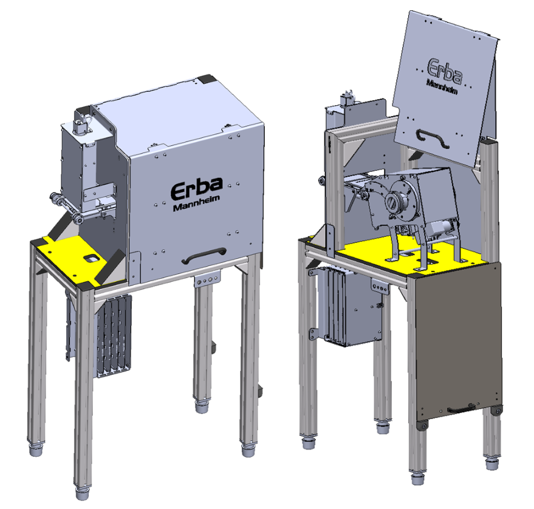 

### Spoiler for the Lotus car (MCAE Systems, 2018) [Tebis/ATOS GOM]
Preparing and protyping of spoiler. Main purpose of this project was progation of 3D technologies capabilities. (click <a href="https://github.com/StingrayCZ/Spoiler-for-Lotus-car/blob/master/README.md"> here</a> for more details)

  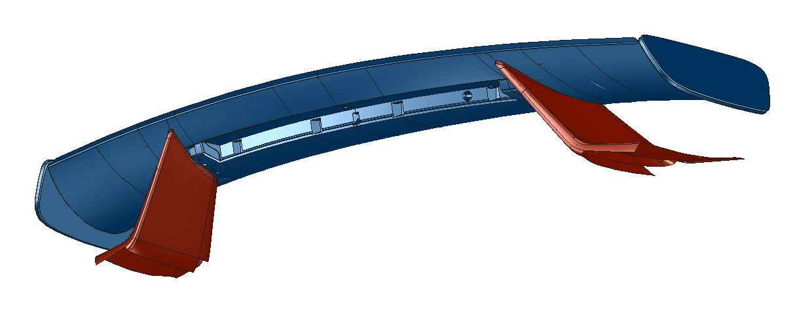 

### Reverse Engineering (MCAE Systems, 2016 - 2019)  [Tebis/ATOS GOM]
Overview of my everyday activity for MCAE Systems (employer). (click <a href="https://github.com/StingrayCZ/Reverse-Engineering/blob/master/README.md"> here</a> for more details)

  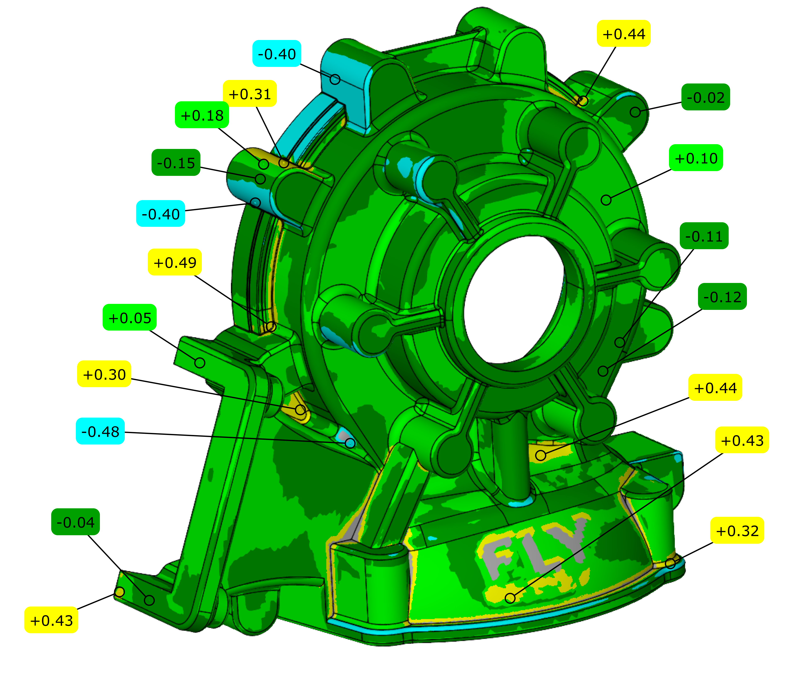 

### TLD JET-16 Airport Tractor (time limited contract, 2016) [SolidWorks]
Welding assembly of the airport truck vehicle. (click <a href="https://github.com/StingrayCZ/Airport-Ground-Support-Vehicle/blob/master/README.md"> here</a> for more details)

  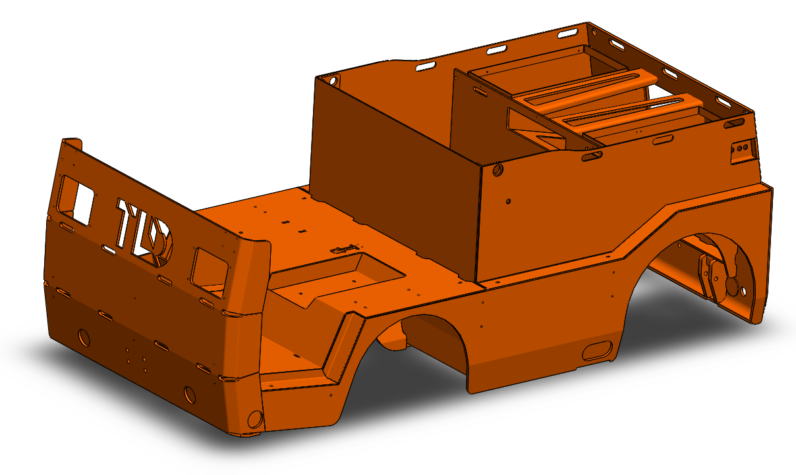 

### Building Facade Superstructure (Solid Vision/Sipral, 2015) [SolidWorks]
Cooperaton project to create 3D CAD data for manufacturing frames from aluminium alloy fror application as facade of building. (click <a href="https://github.com/StingrayCZ/Building-Facade-Superstructure/blob/master/README.md"> here</a> for more details)

  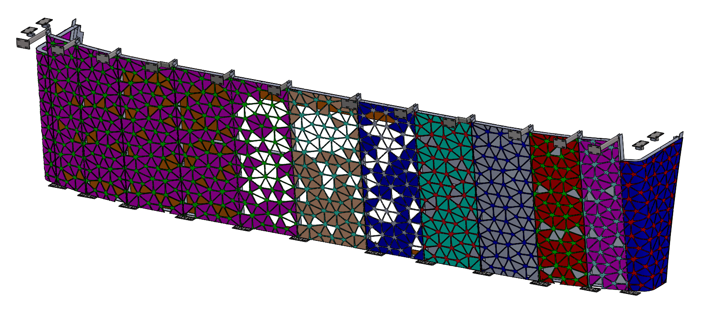 

[//]: # (## Information and Communications Technology section)

[//]: # (Where I would like to introduce my bachelor thehsis. My first larger programming project. This project is **still incompleted but active** and will be **finished to end of August 2020**. )

[//]: # (* Refresh from Sep 2020, Thesis has been successfully defended &#40;see <a href="https://www.vutbr.cz/studenti/zav-prace?zp_id=129386 "> here</a>&#41;)

[//]: # ()
[//]: # (The main task of my thesis &#40;see <a href="https://www.vutbr.cz/www_base/zav_prace_soubor_verejne.php?file_id=216976"> here</a>&#41; is proposal the security of communication in the IoT wireless network. This network is designated for small lowpower devices, like a sensors and trivial actuators. The introduced version is just concept. Although that algorithm is full-operational, provided security level is not suitable for real-life application.)

[//]: # ()
[//]: # (
)

[//]: # (  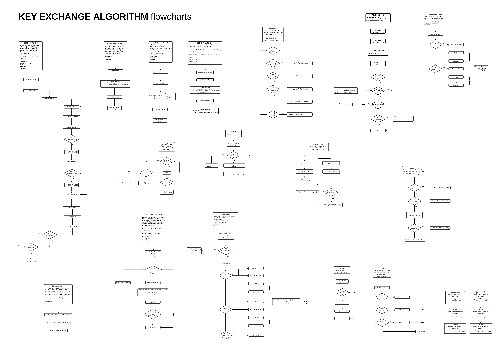 )

[//]: # (
)

[//]: # (          )
          
